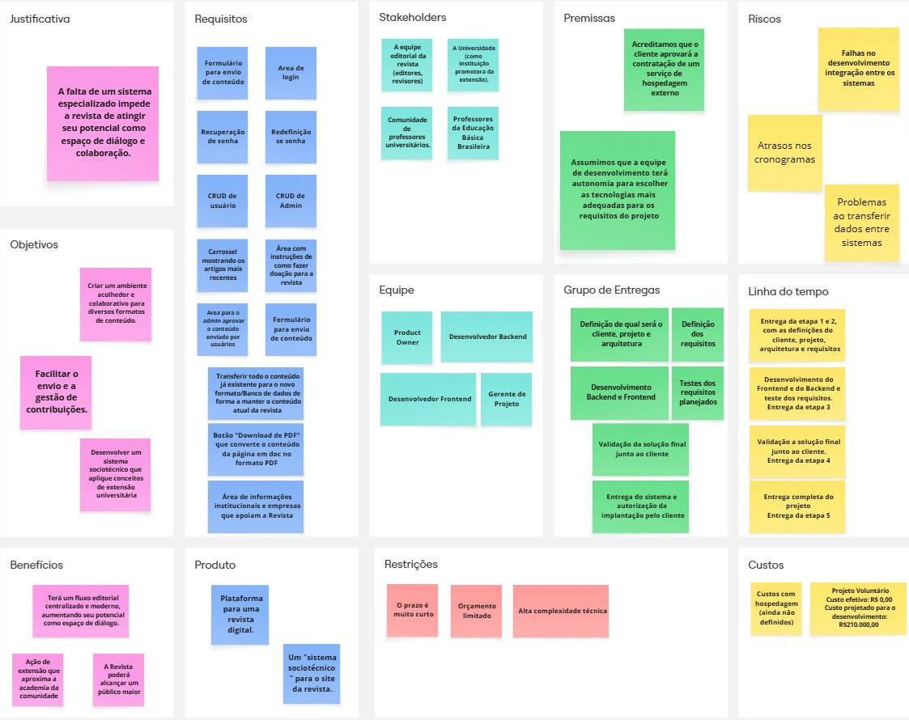
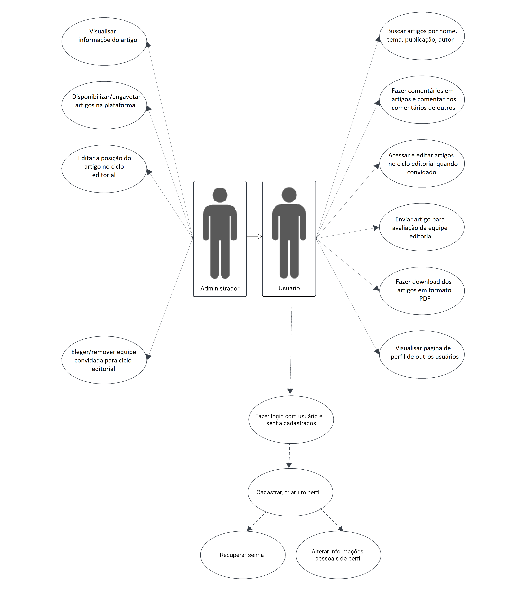

# Especificações do Projeto

<span style="color:red">Pré-requisitos: <a href="01-Documentação de Contexto.md"> Documentação de Contexto</a></span>

Definição do problema e ideia de solução a partir da perspectiva do usuário.

## Usuários

| Tipo de Usuário | Descrição | Responsabilidades |
| --------------- | --------- | ----------------- |
| **xxx**         | xxxxx     | xxxxx             |

### Exemplo

| Tipo de Usuário   | Descrição                                     | Responsabilidades                                                      |
| ----------------- | --------------------------------------------- | ---------------------------------------------------------------------- |
| **Administrador** | Gerencia a aplicação e os usuários.           | Gerenciar usuários, configurar o sistema, acessar todos os relatórios. |
| **Funcionário**   | Usa a aplicação para suas tarefas principais. | Criar e editar registros, visualizar relatórios.                       |

## Arquitetura e Tecnologias

Descreva brevemente a arquitetura definida para o projeto e as tecnologias a serem utilizadas. Sugere-se a criação de um diagrama de componentes da solução.

## Project Model Canvas



## Requisitos

As tabelas que se seguem apresentam os requisitos funcionais e não funcionais que detalham o escopo do projeto.

### Requisitos Funcionais

| ID     | Descrição do Requisito                                                                                                         | Prioridade |
| ------ | ------------------------------------------------------------------------------------------------------------------------------ | ---------- |
| RF-001 | O site deve permitir acesso ao conteúdo sem cadastro, mas restringir interações (ex.: envio de conteúdo, comentários).         | ALTA       |
| RF-002 | O sistema deve possuir área de login de usuário.                                                                               | ALTA       |
| RF-003 | O sistema deve permitir recuperação de senha via e-mail.                                                                       | ALTA       |
| RF-004 | O sistema deve permitir redefinição de senha.                                                                                  | ALTA       |
| RF-005 | O sistema deve permitir cadastro de novos usuários.                                                                            | ALTA       |
| RF-006 | O sistema deve permitir gestão de administradores (cadastro e exclusão).                                                       | ALTA       |
| RF-007 | O sistema deve disponibilizar formulário para envio de conteúdo por usuário.                                                   | ALTA       |
| RF-008 | O sistema deve disponibilizar área para o administrador aprovar/reprovar conteúdos enviados.                                   | ALTA       |
| RF-009 | O sistema deve exibir carrossel com artigos mais recentes.                                                                     | ALTA       |
| RF-010 | O sistema deve disponibilizar área com informações institucionais da Revista.                                                  | ALTA       |
| RF-011 | O sistema deve disponibilizar área com informações sobre o projeto de parceria PUC + UFMG.                                     | MÉDIA      |
| RF-012 | O sistema deve disponibilizar formulários para o administrador criar diferentes tipos de conteúdo (entrevista, blog, notícia). | MÉDIA      |
| RF-013 | O sistema deve permitir inclusão de links de vídeos e imagens nos formulários de usuário e administrador.                      | ALTA       |
| RF-014 | O sistema deve possuir botão para gerar versão em PDF do conteúdo da página.                                                   | ALTA       |
| RF-015 | O sistema deve disponibilizar área com lista de apoiadores/parceiros da revista.                                               | MÉDIA      |
| RF-016 | O sistema deve disponibilizar área com instruções de como realizar doações.                                                    | MÉDIA      |

### Requisitos não Funcionais

| ID      | Descrição do Requisito                                                                       | Prioridade |
| ------- | -------------------------------------------------------------------------------------------- | ---------- |
| RNF-001 | O site deve ser responsivo e adaptável a dispositivos móveis.                                | MÉDIA      |
| RNF-002 | O site deve seguir diretrizes de acessibilidade (WCAG/W3C).                                  | BAIXA      |
| RNF-003 | O site deve disponibilizar barra de pesquisa para facilitar localização de artigos.          | ALTA       |
| RNF-004 | O sistema deve permitir recuperação de senha apenas por e-mail válido.                       | ALTA       |
| RNF-005 | O envio de conteúdo deve gerar confirmação de recebimento ao usuário.                        | MÉDIA      |
| RNF-006 | O sistema deve possuir backups periódicos dos dados.                                         | ALTA       |
| RNF-007 | Senhas devem ser armazenadas criptografadas.                                                 | ALTA       |
| RNF-008 | O sistema deve utilizar protocolo HTTPS.                                                     | MÉDIA      |
| RNF-009 | O acesso administrativo deve possuir autenticação mais restrita.                             | ALTA       |
| RNF-010 | As páginas devem carregar em até 3 segundos em conexões padrão.                              | BAIXA      |
| RNF-011 | O botão de download em PDF deve gerar o arquivo em até 5 segundos.                           | MÉDIA      |
| RNF-012 | O carrossel de artigos deve carregar de forma dinâmica sem comprometer desempenho.           | MÉDIA      |
| RNF-013 | O código deve ser modular e documentado.                                                     | MÉDIA      |
| RNF-014 | O sistema deve permitir atualização de conteúdo sem conhecimento técnico (via painel admin). | ALTA       |
| RNF-015 | O sistema deve ser compatível com navegadores modernos (Chrome, Edge, Firefox, Safari).      | ALTA       |
| RNF-016 | O sistema deve permitir migração de dados do Wordpress atual.                                | ALTA       |
| RNF-017 | O sistema deve suportar aumento de usuários e artigos sem perda de desempenho.               | BAIXA      |

### Restrições do Projeto

| ID  | Restrição                                                                                                                                                    |
| --- | ------------------------------------------------------------------------------------------------------------------------------------------------------------ |
| 01  | O novo site não poderá ser desenvolvido em WordPress, devendo utilizar outra tecnologia definida pela equipe.                                                |
| 02  | Todo o conteúdo existente no site WordPress deve ser migrado para o novo sistema, mantendo consistência e integridade.                                       |
| 03  | O projeto será realizado apenas pelos integrantes do grupo, sem contratação de desenvolvedores externos.                                                     |
| 04  | O site deverá rodar em servidor previamente definido (gratuito ou fornecido pela universidade).                                                              |
| 05  | O projeto não terá orçamento adicional, devendo utilizar apenas recursos gratuitos ou disponibilizados pela instituição.                                     |
| 06  | O cadastro de novos administradores será restrito a outros administradores já existentes, sem autoinscrição.                                                 |
| 07  | O sistema deve ser compatível apenas com navegadores modernos (Chrome, Edge, Firefox, Safari), não havendo suporte a versões antigas como Internet Explorer. |
| 08  | Integrações com indexadores acadêmicos (DOI, Scielo, ORCID) não estão no escopo da primeira versão.                                                          |
| 09  | O site deverá utilizar HTTPS e armazenar senhas criptografadas, não sendo permitido armazenamento em texto puro.                                             |
| 10  | O projeto deverá ser entregue até o final do semestre                                                                                                        |
| 11  | Não pode ser desenvolvido um módulo de backend                                                                                                               |

## Diagrama de Caso de Uso

Abaixo temos o diagrama de casos de uso, ele utiliza um modelo gráfico dos casos de uso e atores. Ele contempla a fronteira do sistema e o detalhamento dos requisitos funcionais com a indicação dos atores, casos de uso e seus relacionamentos.



## Documentação do Banco de Dados MongoDB

Este documento descreve a estrutura e o esquema do banco de dados não relacional utilizado por nosso projeto, baseado em MongoDB. O MongoDB é um banco de dados NoSQL que armazena dados em documentos JSON (ou BSON, internamente), permitindo uma estrutura flexível e escalável para armazenar e consultar dados.

### Serviço: User

---

#### Coleção: `User`

Armazena e gerencia as informações do usuário.

##### Estrutura do Documento

```json
{
  "_id": "67f691c9306a60c15b3e0b48",
  "tipo": "1",
  "email": "Maria@hotmail.com",
  "password": "$2a$11$t.MGyQttY7bm7vERFwsBAua8C3VyjIOpMWe7rKJWxDkhu4Vhwk.jy",
  "name": "Maria",
  "sobrenome": "Mateus",
  "foto": [
    "67f691c9306a60c15b3e0b48",
    "https://rbeducacaobasica.com.br/author/imagem/Leticia.png",
    "172",
    "172"
  ],
  "infoInstitucionais": [{}, {}]
}
```

##### Descrição dos Campos

> - **\_id**: Identificador único do usuário gerado automaticamente pelo MongoDB.
> - **tipo**: Tipo de usuário - 1: usuário normal 0: usuário adm.
> - **email**: Email do usuário.
> - **password**: Senha criptografada do usuário através do BCrypt.Net.
> - **nome**: Nome do usuário.
> - **sobrenome**: Sobrenome do usuário.
> - **foto**: Lista com as informações de \_id, url, width e height da foto de usuário.
> - **infoInstitucionais**: Array de objetos contendo detalhes das informações académicas do usuário (relacionamento com a coleção `infoIstitucionais`).

#### Coleção: `infoIstitucionais`

Cada objeto do array contem uma lista com informações, em ordem definida, sobre o histórico académico do usuário, este pode gerar quantos forem necessários para que todo seu histórico esteja representado em seu perfil.

##### Estrutura do Documento

```json
{
  "instituicao": "PUC Minas",
  "curso": "Analise e Desenvolvimento de Sistemas",
  "dataInicio": "10/02/2019",
  "dataFim": "10/12/2023",
  "descircaoCurso": "O curso de Análise e Desenvolvimento de Sistemas (ADS) é uma graduação tecnológica de nível superior focada no mercado de trabalho, com duração de dois a três anos, que capacita o aluno a projetar, desenvolver e manter sistemas de software, com foco prático em programação, bancos de dados, engenharia de software e segurança da informação.",
  "infomacoesAdd": "Fui representante de sala",
  "redesSociais": "@leticiaMateus07"
}
```

##### Descrição dos Campos

> - **instituicao**: Informações sobre a instituição cuja qual o usuário cursou.
> - **curso**: Informações sobre o curso que o usuário fez ou faz.
> - **dataInicio**: Data de inicio da graduação ou curso.
> - **dataFim**: Data de termino efetivo da graduação ou curso.
> - **descricaoCurso**: Descrição da graduação ou curso.
> - **informacoesAdd**: Informações adcionais da graduação ou curso.
> - **redesSociais**: Link das redes sociais do usuário.

### Serviço: Artigo

---

#### Coleção: `Artigo`

Armazena e gerencia as informações das postagens associadas aos artigos, entradas no blog, comentários, entrevistas, outras postagens da plataforma e o ciclo editorial por completo em um formato que permite que a maior parte do processamento necessário para configurar corretamente o artigo possa ser obitida no mesmo elemento json.

##### Estrutura do Documento

```json
{
  "_id": "1",
  "Post": {}
}
```

##### Descrição dos Campos

> - **\_id**: Identificador único do usuário gerado automaticamente pelo MongoDB.
> - **Post**: Objeto contendo todas as informações sobre a postagem (relacionamento com a coleção `Post`).

#### Coleção `Post`

Objeto contendo todas as informações sobre a postagem.

##### Estrutura do Documento

```json
{
  "Autor": {},
  "Titulo": "Como se tornar o melhor detetive digital do mundo",
  "Data": {},
  "Situacao": "editorial",
  "Interacao": {},
  "Midia": {},
  "Colecao": {},
  "Conteudo": {},
  "CicloEditorial": {}
}
```

##### Descrição dos Campos

> - **Autor**: Objeto contendo todas as informações sobre a(os) autor(es) da postagem (relacionamento com a coleção `Autor`).
> - **Titulo**:
> - **Data**: Objeto contendo todas as informações sobre as datas de importância postagem (relacionamento com a coleção `Data`).
> - **Situacao**:
> - **Interacao**: Objeto contendo todas as informações sobre as interações para com a postagem (relacionamento com a coleção `Interacao`).
> - **Midia**: Objeto contendo todas as informações sobre as midias da postagem (relacionamento com a coleção `Midia`).
> - **Colecao**: Objeto contendo todas as informações sobre a edição da revista na qual foi publicada esta postagem (relacionamento com a coleção `Colecao`).
> - **Conteudo**: Objeto contendo todas as informações do artigo da postagem (relacionamento com a coleção `Conteudo`).
> - **CicloEditorial**: Objeto contendo todas as informações sobre o ciclo editorial da postagem (relacionamento com a coleção `CicloEditorial`).

#### Coleção `Autor`

Objeto contendo todas as informações sobre a(os) autor(es) da postagem.

##### Estrutura do Documento

```json
{
  "AutorCadastrado": [
    "67f691c9306a60c15b3e0b48",
    "35p691c9306a60c15b3e0c86",
    "65f41645r6546r3f94e10dda"
  ],
  "Outros": ["Sir Arthur Conan Doyle", "Agatha Christie", "Dorothy L. Sayers"]
}
```

##### Descrição dos Campos

> - **AutorCadastrado**: lista contendo as IDs dos autores responsáveis pela postagem no caso deles estarem cadastrados no site.
> - **Outros**: Lista contendo o nome de todos os autores não cadastrados na plataforma envolvidos na postagem.

#### Coleção `Data`

Objeto contendo todas as informações sobre as datas de importância postagem.

##### Estrutura do Documento

```json
{
  "DEnvio": "07/09/2024",
  "DAcade": "09/12/2024",
  "DPubli": "01/01/2025",
  "DEdicaoEditorial": "05/06/2025"
}
```

##### Descrição dos Campos

> - **DEnvio**: Data na qual o artigo foi submetido pelo autor na plataforma.
> - **DAcade**: Data da primeira publicação via outro periódico académico.
> - **DPlubi**: Data na qual o artigo foi oficialmente disponibilizado ao público por meio da platafor.
> - **DEdicaoEditorial**: Data da ultima modificação feita no artigo pela equipe editorial.

#### Coleção `Interacao`

Objeto contendo todas as informações sobre as interações para com a postagem.

##### Estrutura do Documento

```json
{
  "CPadrao": {},
  "CEditorial": {}
}
```

##### Descrição dos Campos

> - **CPadrao**: Objeto contendo todas as interações por usuários Padrão pela plataforma (relacionamento com a coleção `CPadrao`).
> - **CEditorial**: Objeto contendo as considerações finais da equipe envolvida no ciclo editorial do artigo (relacionamento com a coleção `CEditorial`).

#### Coleção `Midia`

Objeto contendo todas as informações sobre as midias da postagem.

##### Estrutura do Documento

```json
{
  "Destaque": {},
  "0": {},
  "1": {}
}
```

##### Descrição dos Campos

> - **Destaque**: Objeto contendo as informações da imagem de destaque do artigo ( relacionamento com a coleção `Destaque`).
> - **n**: Objeto gerado pelo formulário de envio de artigos que contem as informações de cada imagem individual dentro do artigo ( usa o mesmo modelo de relacionamento da coleção `Destaque`).

#### Coleção `Destaque`

Objeto contendo as informações das imagens do artigo, sendo o exemplo a imagem de destaque.

##### Estrutura do Documento

```json
{
  "_id": "1",
  "Descritivo": "Autora sentada de frente para a camera sorrindo com seu livro em mãos",
  "Url": "https://rbeducacaobasica.com.br/author/imagem/Leticia.png",
  "Width": "172",
  "Height": "172"
}
```

##### Descrição dos Campos

> - **\_id**: Informa a ID da imagem em questão.
> - **Descritivo**: Texto que descreve o que tem na imagem para objeto de contexto no elemento da imagem na plataforma.
> - **Url**: Endereço url da midia.
> - **Width**: Informa o valor ideal de uso do elemento CSS Width para a imagem nesta situação.
> - **Height**: Informa o valor ideal de uso do elemento CSS Height para a imagem nesta situação.

#### Coleção `Colecao`

Objeto contendo todas as informações sobre a edição da revista na qual foi publicada esta postagem.

##### Estrutura do Documento

```json
{
  "Edicao": ["10", "34", "agosto", "2025"],
  "Categoria": "1"
}
```

##### Descrição dos Campos

> - **Edicao**: Array contendo as inforções da edição da Revista Brasileira de Educação Básica na qual o artigo foi publicado, estes em formato de texto na seguinte ordem: volume, edição, mes e ano.
> - **Categoria**: Indice que informa em que categoria o artigo pode ser encontrado na plataforma - 0: blog -1: artigo -2: entrevista -3: podcast.

#### Coleção `Conteudo`

Objeto contendo todas as informações do artigo da postagem.

##### Estrutura do Documento

```json
{
  "Tipo": "1",
  "Artigo": "string",
  "Resumo": "string"
}
```

##### Descrição dos Campos

> - **Tipo**: Valor que informa se o artigo é legado ou não - 0: "legado" 1: "padrão".
> - **Artigo**: String contendo todo o artigo em sua configuração final, pronto para exibição no formato HTML e já contendo os elementos CSS definidos nele.
> - **Resumo**: Texto breve que descreve o artigo para uso em slides de divulgação na plataforma.

#### Coleção `CicloEditorial`

Objeto contendo todas as informações sobre o ciclo editorial da postagem.

##### Estrutura do Documento

```json
{
  "PosiCiclo": "4",
  "Revisores": [
    "67eb5237d73b3e3f94e10dda",
    "67eb5249d73b3e3f94e10ddb",
    "67eb5252d73b3e3f94e10ddc"
  ],
  "Cmt": {},
  "Historia": ["string", "string", "string"]
}
```

##### Descrição dos Campos

> - **PosiCiclo**: Valor que informa em qual momento do ciclo editorial o aritgo se encontra - 0: "recebido" 1: "comentarios" 2: "correção" 3: "revisão" 4: "publicado" 5: "engavetado".
> - **Revisores**: Lista com as IDs dos convidados para comentar, avaliar e revisar o artigo.
> - **Cmt**: Objeto contendo todos os comentários, respostas, posições e elementos de estilo do artigo ( relação com a coleção `Cmt`).
> - **Historia**: Lista contendo as varias versões do artigo que foram produzidas durante o ciclo editorial ao longo do tempo em ordem cronológica.

### Serviço: Media

---

#### Coleção: `Media`

Armazena e gerencia as informações das midias associadas aos artigos, perfil de usuário, entrevistas e outras postagens da plataforma.

##### Estrutura do Documento

```json
{
  "_id": "1",
  "tipo": "0",
  "url": "https://rbeducacaobasica.com.br/author/imagem/Leticia.png"
}
```

##### Descrição dos Campos

> - **\_id**: Identificador numérico inteiro.
> - **tipo**: Valor que informa o tipo de midia - 0: img, 1: video, 2: audio, 3: pdf.
> - **url**: Endereço url da midia.
