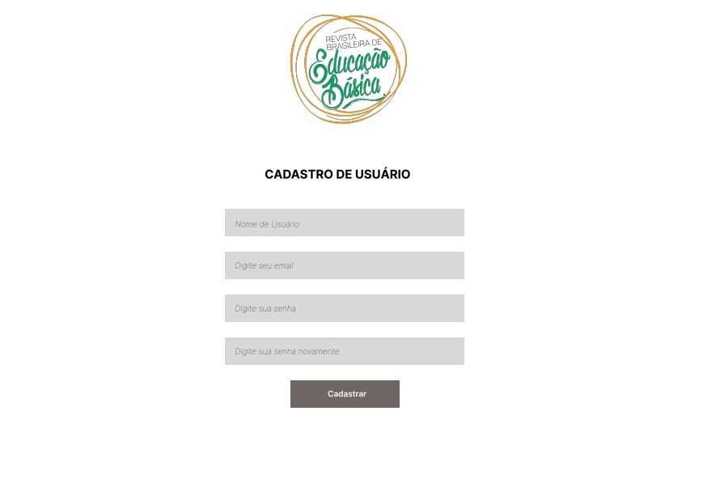
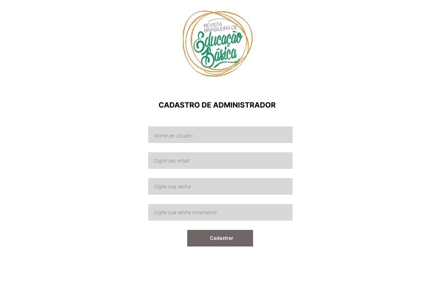
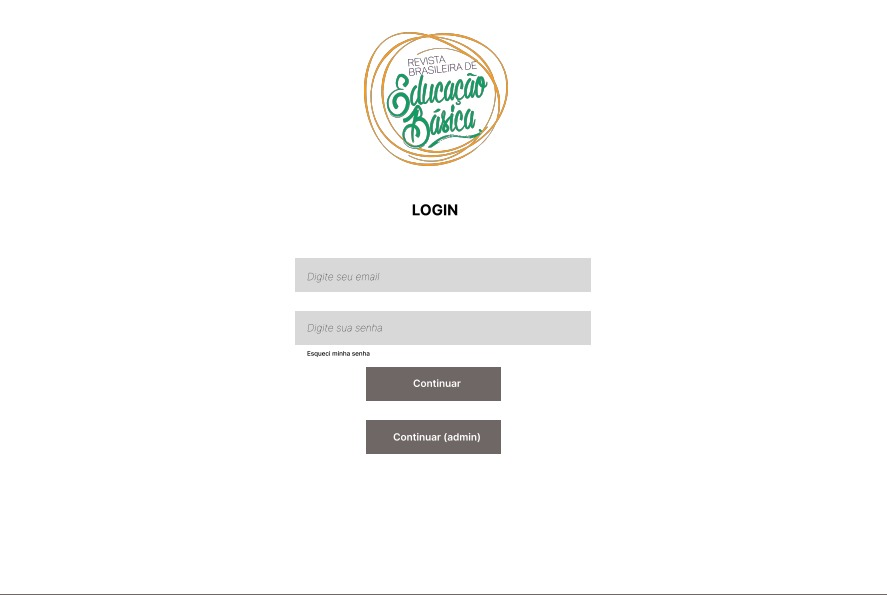
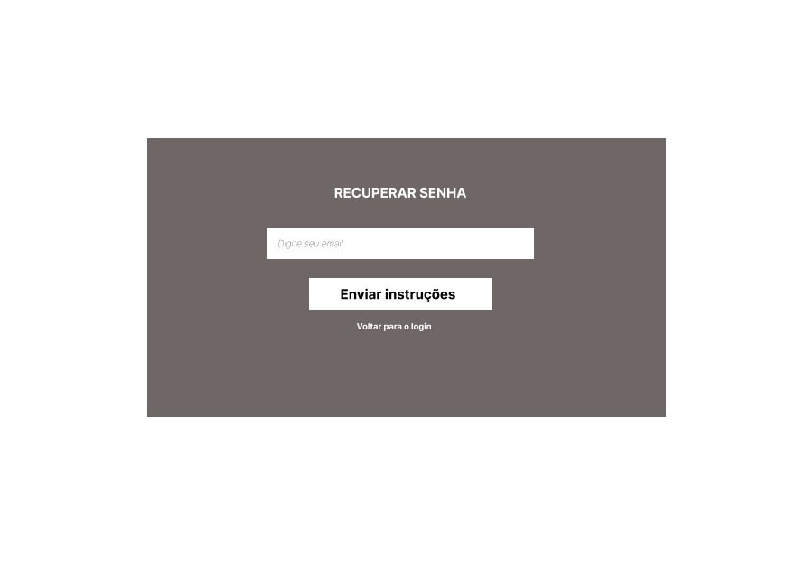
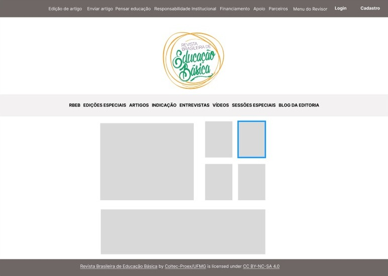
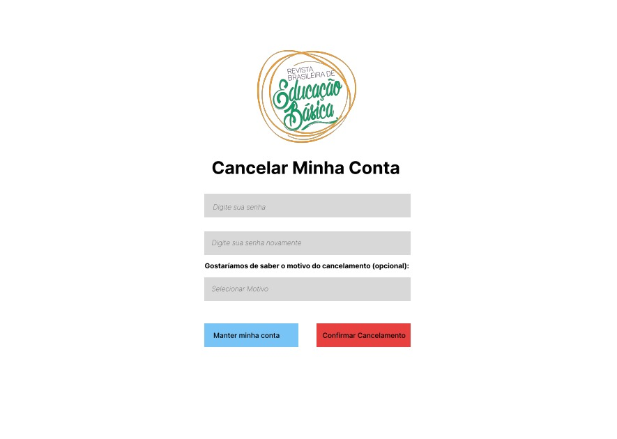
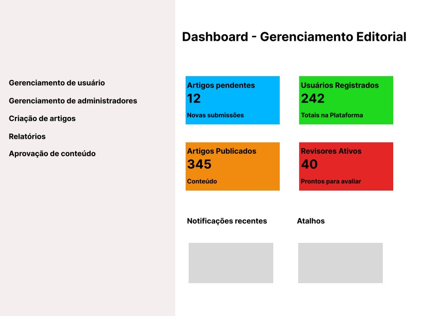
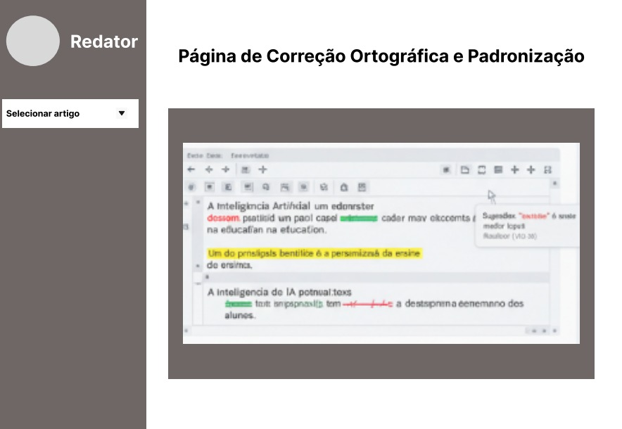
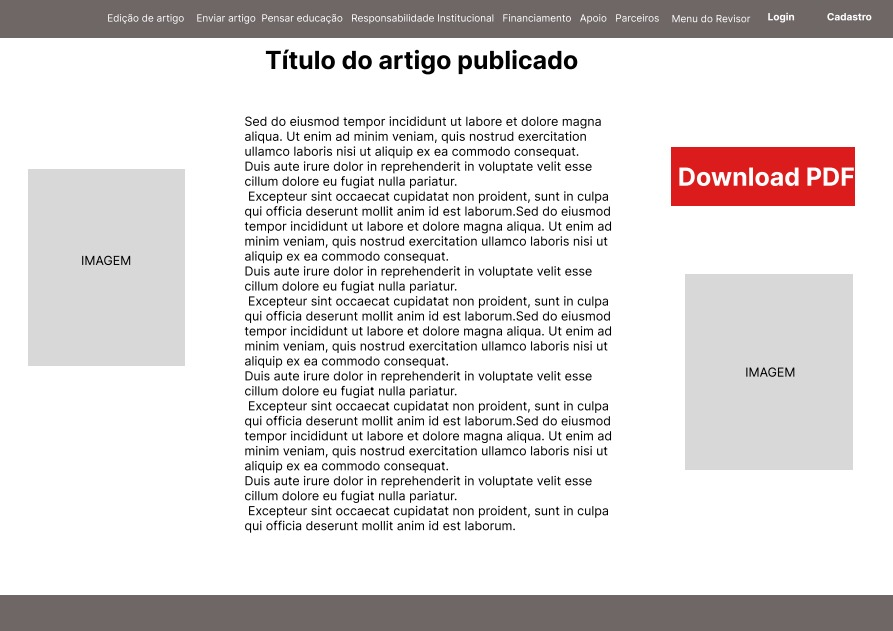

# Projeto de Interface

## Wireframe
### Tela de Cadastro de Usuário

Objetivo: Permitir que novos utilizadores criem uma conta na plataforma da revista.
### Tela de Cadastro de Administrador

Objetivo: Criar novas contas de administrador no sistema. 

### Tela de Login

Objetivo: Permitir que utilizadores e administradores acedam às suas contas.

### Tela de Recuperar Senha

Objetivo: Ajudar o utilizador a redefinir a sua senha caso a tenha esquecido.

### Home Page (Página Inicial da Revista)

Objetivo: Apresentar o conteúdo mais relevante da revista aos visitantes e leitores.

### Tela de Cancelamento de Conta (Usuário)

Objetivo: Permitir que o utilizador encerre a sua conta de forma definitiva.

### Página de Edição do Artigo (Autor)

.jpeg)

Objetivo: Permitir que o autor edite os seus próprios artigos (rascunhos ou com revisões solicitadas).

### Formulário de Envio de Artigo (Usuário)

.jpeg)

Objetivo: Possibilitar que um autor submeta um novo artigo para revisão.

### Página de Edição do Artigo (Convidados/Revisores)

.jpeg)

Objetivo: Fornecer uma interface para revisores avaliarem um artigo atribuído.

### Aprovação de Conteúdo e Listagem dos Convidados (Administrador)

.jpeg)

Objetivo:  Gerenciar o fluxo de artigos pendentes de aprovação e a atribuição de revisores.

### Gerenciamento Editorial (Painel do Administrador)

Objetivo: Visão geral e ponto de partida para as principais tarefas administrativas da revista.

### Página de Correção Ortográfica e Padronização (Redator)

Objetivo: Permitir que o redator faça a revisão final de texto, gramática e formatação do artigo antes da publicação.

### Página de Visualização do Artigo Publicado

Objetivo: Mostrar o artigo finalizado ao público em geral e permitir o download para PDF.

